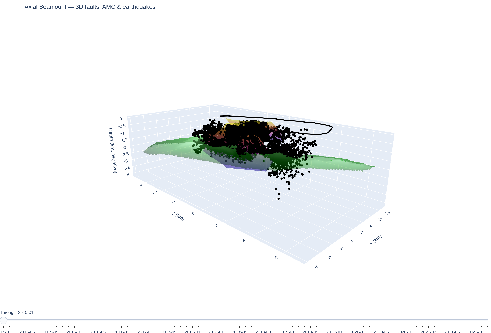

# Axial Visuals

Interactive 3D visualizations of [Axial Seamount](https://en.wikipedia.org/wiki/Axial_Seamount):
caldera-wall fault surfaces, the axial magma chamber (AMC) reflector, the caldera rim,
and the earthquake catalog with a month-by-month time slider.

Everything is built in `axial visuals.ipynb` using [Plotly](https://plotly.com/python/),
and each cell writes a self-contained, rotatable HTML file (Plotly loaded from CDN).



*Preview of `axial_3d_with_amc_slider_MASKED.html` (full earthquake catalog). Open the HTML
file in a browser for the interactive, rotatable view with the month-by-month time slider.*

## Output

The final visualization is **`axial_3d_with_amc_slider_MASKED.html`** (produced by the last
cell of the notebook): the AMC reflector is reprojected via UTM → lat/lon, clipped to its
convex-hull footprint, and the surfaces are colored. Earlier notebook cells explore other
AMC-gridding approaches but their HTML exports are not kept.

The plot contains:

- **West wall** and **East wall** — polynomial fault surfaces fit to wall point clouds
- **AMC surface** — magma-chamber reflector top
- **Caldera rim** — outline parsed from the MATLAB rim file
- **Earthquakes** — `Scatter3d` points, colored by depth, revealed cumulatively by a per-month slider

## Input data

| File | Contents |
|------|----------|
| `I_fitting_WW_slices.mat` | West-wall point cloud (`fit_x_y_z`) |
| `East_Felix_06_Dis.mat` | East-wall locations (lat/lon/depth struct) |
| `FA_Cl_ALL_simple.mat` | Earthquake catalog (lat/lon/depth + `on` MATLAB datenum) |
| `axial_calderaRim.m` | Caldera rim polygon (lon/lat) |
| `axial_amc_top_utm_norm_km_20000.xyz` | AMC top, UTM-offset XYZ |
| `latlon2xy_no_rotate.m` | Reference MATLAB coordinate transform |

## Coordinate frame

All layers are placed in a local km frame centered on AXCC1 (`lat0 = 45.9547`, `lon0 = -130.0089`)
via `latlon2xy_no_rotate`. Depths are negative-down. The AMC `.xyz` is in UTM zone 9N offsets,
converted UTM → lat/lon → local km before plotting.

## Running

The notebook requires Plotly, which lives in the `seismk` conda environment:

```bash
conda activate seismk        # plotly 6.5.2, scipy, matplotlib, numpy
jupyter notebook "axial visuals.ipynb"
```

Run a cell from top to bottom; it writes the corresponding HTML next to the notebook.
Open the HTML in any browser to rotate, zoom, and drag the time slider.

> Note: the base anaconda env and other kernels do not have Plotly installed —
> running there raises `ModuleNotFoundError: No module named 'plotly'`.
